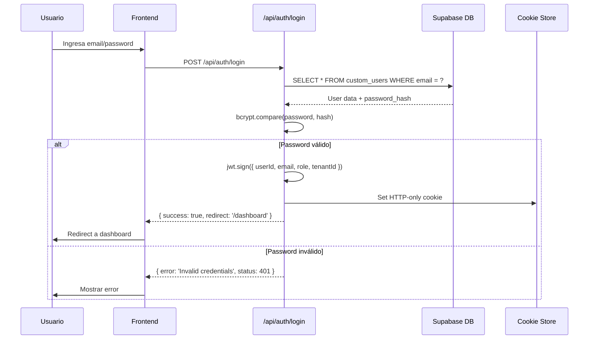
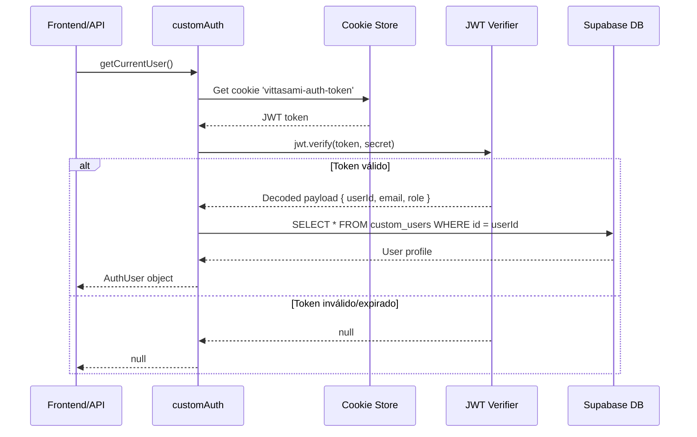
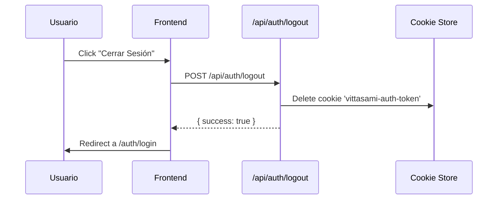
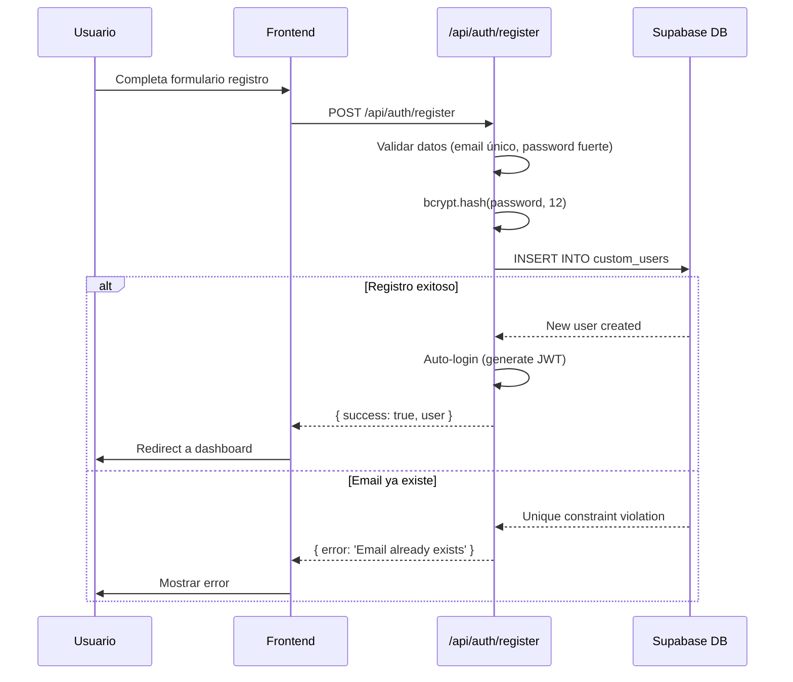

# Sistema de Autenticación - VittaSami

**Versión:** 1.0
**Última actualización:** Noviembre 2025
**Autor:** Tech Team VittaSami

---

## 📋 Índice

1. [Resumen Ejecutivo](#resumen-ejecutivo)
2. [Arquitectura](#arquitectura)
3. [Flujos de Autenticación](#flujos-de-autenticación)
4. [Implementación Técnica](#implementación-técnica)
5. [Roles y Permisos](#roles-y-permisos)
6. [Seguridad](#seguridad)
7. [API Reference](#api-reference)
8. [Troubleshooting](#troubleshooting)

---

## 🎯 Resumen Ejecutivo

### ¿Por qué NO usamos Supabase Auth?

**Decisión de arquitectura:** VittaSami usa un sistema de autenticación **custom con JWT + bcrypt** en lugar de Supabase Auth.

**Razones:**

1. **Control total:** Necesitamos lógica custom de autenticación (multi-tenant, roles complejos)
2. **Migración de usuarios:** Facilita migración desde sistemas legacy
3. **Flexibilidad:** Podemos implementar features específicos (2FA, SSO) sin limitaciones
4. **Independencia:** No dependemos de un proveedor específico para auth

### Stack Tecnológico

```yaml
Password Hashing: bcrypt (12 rounds)
Tokens: JWT (jsonwebtoken)
Storage: HTTP-only cookies
Database: Supabase (solo para almacenamiento)
Session Duration: 7 días
```

---

## 🏗️ Arquitectura

### Componentes Principales

```
┌─────────────────────────────────────────────────────────────┐
│                        FRONTEND                              │
│  ┌──────────────┐  ┌──────────────┐  ┌──────────────┐      │
│  │ Login Form   │  │  AuthContext │  │ Protected    │      │
│  │              │→ │              │→ │ Routes       │      │
│  └──────────────┘  └──────────────┘  └──────────────┘      │
└────────────────────────────┬────────────────────────────────┘
                             │ HTTP Request
                             │ (Cookie: vittasami-auth-token)
                             ↓
┌─────────────────────────────────────────────────────────────┐
│                    BACKEND (Next.js)                         │
│  ┌──────────────────────────────────────────────────────┐  │
│  │               /api/auth/login                         │  │
│  │  1. Validate email/password                          │  │
│  │  2. Generate JWT                                     │  │
│  │  3. Set HTTP-only cookie                            │  │
│  └──────────────────────────────────────────────────────┘  │
│                                                              │
│  ┌──────────────────────────────────────────────────────┐  │
│  │          customAuth.getCurrentUser()                  │  │
│  │  1. Read cookie                                      │  │
│  │  2. Verify JWT                                       │  │
│  │  3. Fetch user from DB                              │  │
│  └──────────────────────────────────────────────────────┘  │
└────────────────────────────┬────────────────────────────────┘
                             │ SQL Query
                             ↓
┌─────────────────────────────────────────────────────────────┐
│                  SUPABASE (PostgreSQL)                       │
│  ┌──────────────────────────────────────────────────────┐  │
│  │             custom_users table                        │  │
│  │  - id (uuid)                                         │  │
│  │  - email (text)                                      │  │
│  │  - password_hash (text) ← bcrypt                    │  │
│  │  - role (user_role enum)                            │  │
│  │  - tenant_id (uuid)                                 │  │
│  └──────────────────────────────────────────────────────┘  │
└─────────────────────────────────────────────────────────────┘
```

### Tabla: custom_users

```sql
CREATE TYPE user_role AS ENUM (
  'super_admin',
  'admin_tenant',
  'staff',
  'receptionist',
  'doctor',
  'member',
  'patient'
);

CREATE TABLE custom_users (
  id UUID PRIMARY KEY DEFAULT uuid_generate_v4(),
  email TEXT UNIQUE NOT NULL,
  password_hash TEXT,  -- bcrypt hash
  first_name TEXT,
  last_name TEXT,
  phone TEXT,
  role user_role NOT NULL DEFAULT 'patient',
  tenant_id UUID REFERENCES tenants(id),
  schedulable BOOLEAN DEFAULT false,
  created_at TIMESTAMPTZ DEFAULT NOW(),
  updated_at TIMESTAMPTZ DEFAULT NOW()
);

-- Index para búsquedas rápidas
CREATE INDEX idx_custom_users_email ON custom_users(email);
CREATE INDEX idx_custom_users_tenant_id ON custom_users(tenant_id);
```

---

## 🔄 Flujos de Autenticación

### 1. Login (Sign In)



**Código:**

```typescript
// src/app/api/auth/login/route.ts
export async function POST(request: NextRequest) {
  const { email, password } = await request.json()

  // 1. Autenticar usuario
  const user = await customAuth.authenticateUser(email, password)
  if (!user) {
    return NextResponse.json({ error: 'Invalid credentials' }, { status: 401 })
  }

  // 2. Generar JWT
  const token = customAuth.generateToken({
    userId: user.id,
    email: user.email,
    role: user.role,
    tenantId: user.tenant_id || undefined
  })

  // 3. Guardar en cookie
  await customAuth.setAuthCookie(token)

  // 4. Determinar redirect según rol
  const redirectPath = customAuth.getRedirectPath(user)

  return NextResponse.json({ success: true, redirect: redirectPath })
}
```

### 2. Verificar Sesión (getCurrentUser)



**Código:**

```typescript
// src/lib/custom-auth.ts
async getCurrentUser(): Promise<AuthUser | null> {
  const cookieStore = await cookies()
  const token = cookieStore.get('vittasami-auth-token')?.value

  if (!token) return null

  // Verificar JWT
  const payload = this.verifyToken(token)
  if (!payload) return null

  // Fetch datos frescos del usuario
  const { data: profile } = await this.supabase
    .from('custom_users')
    .select('*')
    .eq('id', payload.userId)
    .single()

  if (!profile) return null

  return {
    id: profile.id,
    email: profile.email,
    profile: profile  // incluye role, tenant_id, etc.
  }
}
```

### 3. Logout (Sign Out)



**Código:**

```typescript
// src/app/api/auth/logout/route.ts
export async function POST() {
  await customAuth.clearAuthCookie()
  return NextResponse.json({ success: true })
}
```

### 4. Registro (Sign Up)



---

## 💻 Implementación Técnica

### CustomAuthService (src/lib/custom-auth.ts)

**Clase principal que maneja toda la autenticación:**

```typescript
export class CustomAuthService {
  private supabase = getSupabaseClient()

  // 1. GENERACIÓN DE TOKEN JWT
  generateToken(payload: { userId, email, role, tenantId? }): string {
    return jwt.sign(payload, JWT_SECRET, { expiresIn: '7d' })
  }

  // 2. VERIFICACIÓN DE TOKEN JWT
  verifyToken(token: string): JWTPayload | null {
    try {
      return jwt.verify(token, JWT_SECRET) as JWTPayload
    } catch {
      return null
    }
  }

  // 3. HASH DE PASSWORD
  async hashPassword(password: string): Promise<string> {
    return bcrypt.hash(password, 12)  // 12 rounds
  }

  // 4. VERIFICAR PASSWORD
  async verifyPassword(password: string, hash: string): Promise<boolean> {
    return bcrypt.compare(password, hash)
  }

  // 5. AUTENTICAR USUARIO
  async authenticateUser(email: string, password: string): Promise<UserProfile | null> {
    // Buscar usuario por email
    const { data: user } = await this.supabase
      .from('custom_users')
      .select('*')
      .eq('email', email)
      .single()

    if (!user) return null

    // Fallback para usuarios sin password_hash (demo)
    if (!user.password_hash && password === 'password') {
      return user
    }

    // Verificar password
    const isValid = await this.verifyPassword(password, user.password_hash)
    return isValid ? user : null
  }

  // 6. COOKIES
  async setAuthCookie(token: string): Promise<void> {
    const cookieStore = await cookies()
    cookieStore.set('vittasami-auth-token', token, {
      httpOnly: true,
      secure: process.env.NODE_ENV === 'production',
      sameSite: 'lax',
      maxAge: 7 * 24 * 60 * 60,  // 7 días
      path: '/'
    })
  }

  async clearAuthCookie(): Promise<void> {
    const cookieStore = await cookies()
    cookieStore.delete('vittasami-auth-token')
  }

  // 7. OBTENER USUARIO ACTUAL
  async getCurrentUser(): Promise<AuthUser | null> {
    // Ver código completo arriba
  }

  // 8. CREAR USUARIO
  async createUser(userData: {...}): Promise<{ user, error }> {
    const password_hash = await this.hashPassword(userData.password)

    const { data: newUser, error } = await this.supabase
      .from('custom_users')
      .insert({
        id: crypto.randomUUID(),
        email: userData.email,
        password_hash,
        first_name: userData.first_name,
        last_name: userData.last_name,
        role: userData.role || 'patient',
        tenant_id: userData.tenant_id
      })
      .select()
      .single()

    return { user: newUser, error: error?.message || null }
  }

  // 9. ACTUALIZAR PASSWORD
  async updatePassword(userId: string, newPassword: string): Promise<{ error }> {
    const password_hash = await this.hashPassword(newPassword)

    const { error } = await this.supabase
      .from('custom_users')
      .update({ password_hash, updated_at: new Date().toISOString() })
      .eq('id', userId)

    return { error: error?.message || null }
  }

  // 10. DETERMINAR REDIRECT SEGÚN ROL
  getRedirectPath(profile: UserProfile): string {
    switch (profile.role) {
      case 'super_admin':
        return '/admin/manage-users'
      case 'admin_tenant':
      case 'staff':
      case 'receptionist':
        return `/dashboard/${profile.tenant_id || ''}`
      case 'doctor':
        return '/agenda'
      case 'patient':
        return '/my-appointments'
      default:
        return '/dashboard'
    }
  }
}

// Singleton export
export const customAuth = new CustomAuthService()
```

### Middleware de Autenticación

```typescript
// src/middleware.ts
import { NextResponse } from 'next/server'
import type { NextRequest } from 'next/server'

export async function middleware(request: NextRequest) {
  const { pathname } = request.nextUrl

  // Rutas públicas (no requieren auth)
  const publicPaths = ['/auth/login', '/auth/register', '/']
  if (publicPaths.includes(pathname)) {
    return NextResponse.next()
  }

  // Verificar cookie de auth
  const token = request.cookies.get('vittasami-auth-token')?.value

  if (!token) {
    // Redirect a login
    return NextResponse.redirect(new URL('/auth/login', request.url))
  }

  // TODO: Opcionalmente verificar JWT aquí
  // Por ahora, confiamos en que getCurrentUser() lo hará

  return NextResponse.next()
}

export const config = {
  matcher: [
    '/dashboard/:path*',
    '/admin/:path*',
    '/agenda/:path*',
    '/patients/:path*'
  ]
}
```

### Proteger Server Components

```typescript
// src/app/dashboard/page.tsx
import { redirect } from 'next/navigation'
import { customAuth } from '@/lib/custom-auth'

export default async function DashboardPage() {
  // Verificar autenticación
  const user = await customAuth.getCurrentUser()

  if (!user) {
    redirect('/auth/login')
  }

  // Verificar permisos
  if (user.profile?.role === 'patient') {
    redirect('/my-appointments')  // Pacientes no acceden a dashboard
  }

  // Renderizar página
  return <div>Dashboard para {user.email}</div>
}
```

### Proteger API Routes

```typescript
// src/app/api/tenants/[tenantId]/users/route.ts
import { customAuth } from '@/lib/custom-auth'

export async function GET(
  request: NextRequest,
  { params }: { params: { tenantId: string } }
) {
  // 1. Autenticación
  const user = await customAuth.getCurrentUser()
  if (!user) {
    return NextResponse.json({ error: 'Unauthorized' }, { status: 401 })
  }

  // 2. Autorización (tenant ownership)
  const { tenantId } = params
  if (user.profile?.tenant_id !== tenantId && user.profile?.role !== 'super_admin') {
    return NextResponse.json({ error: 'Forbidden' }, { status: 403 })
  }

  // 3. Lógica del endpoint
  // ...
}
```

---

## 👥 Roles y Permisos

### Jerarquía de Roles

```
super_admin (sin tenant)
  ├─ Puede ver/editar TODOS los tenants
  ├─ Gestionar usuarios de todos los tenants
  └─ Acceso completo a sistema

admin_tenant (con tenant_id)
  ├─ Gestionar usuarios de SU tenant
  ├─ Configuración del tenant
  └─ Ver reportes del tenant

staff (con tenant_id)
  ├─ Gestionar citas
  ├─ Gestionar pacientes
  └─ Ver agenda

receptionist (con tenant_id)
  ├─ Crear/modificar citas
  ├─ Registrar pacientes
  └─ Ver agenda

doctor (con tenant_id)
  ├─ Ver SU agenda
  ├─ Atender pacientes
  └─ Crear historias clínicas

member (con tenant_id)
  ├─ Ver SU agenda
  └─ Atender clientes (spas, centros de bienestar)

patient (puede tener tenant_id o null)
  ├─ Ver SUS citas
  ├─ Reservar citas
  └─ Ver SU historial
```

### Matriz de Permisos

| Recurso                | super_admin | admin_tenant | staff | receptionist | doctor | patient |
|------------------------|-------------|--------------|-------|--------------|--------|---------|
| Ver todos los tenants  | ✅          | ❌           | ❌    | ❌           | ❌     | ❌      |
| Gestionar usuarios     | ✅ (todos)  | ✅ (su tenant)| ❌   | ❌           | ❌     | ❌      |
| Ver agenda completa    | ✅          | ✅           | ✅    | ✅           | ❌     | ❌      |
| Ver su agenda          | N/A         | N/A          | N/A   | N/A          | ✅     | ❌      |
| Crear citas            | ✅          | ✅           | ✅    | ✅           | ✅     | ✅      |
| Modificar citas        | ✅          | ✅           | ✅    | ✅           | ✅ (propias) | ✅ (propias) |
| Gestionar pacientes    | ✅          | ✅           | ✅    | ✅           | ❌     | ❌      |
| Ver historias clínicas | ✅          | ✅           | ❌    | ❌           | ✅     | ✅ (propia) |
| Configurar tenant      | ✅          | ✅           | ❌    | ❌           | ❌     | ❌      |

---

## 🔒 Seguridad

### 1. Password Security

**Hashing:**
```typescript
// Bcrypt con 12 rounds (2^12 = 4096 iteraciones)
const hash = await bcrypt.hash(password, 12)

// Tiempo de hashing: ~200-300ms (ideal para prevenir brute force)
```

**Requisitos de password:**
```typescript
// TODO: Implementar validación
function validatePassword(password: string): boolean {
  return (
    password.length >= 8 &&
    /[A-Z]/.test(password) &&  // Al menos 1 mayúscula
    /[a-z]/.test(password) &&  // Al menos 1 minúscula
    /[0-9]/.test(password)     // Al menos 1 número
  )
}
```

### 2. JWT Security

**Configuración:**
```typescript
const JWT_SECRET = process.env.JWT_SECRET || 'vittasami-dev-secret-key-2024'
const JWT_EXPIRES_IN = '7d'

// ⚠️ En producción: JWT_SECRET debe ser fuerte y aleatorio
// Generar con: openssl rand -base64 32
```

**Payload mínimo:**
```typescript
interface JWTPayload {
  userId: string       // ID del usuario
  email: string        // Email (para logging)
  role: string         // Rol (para permisos rápidos)
  tenantId?: string    // Tenant (para filtrado)
  iat: number          // Issued at (auto)
  exp: number          // Expiration (auto)
}

// NO incluir: password, password_hash, información sensible
```

### 3. Cookie Security

```typescript
cookieStore.set('vittasami-auth-token', token, {
  httpOnly: true,        // ✅ No accesible desde JavaScript
  secure: NODE_ENV === 'production',  // ✅ Solo HTTPS en prod
  sameSite: 'lax',      // ✅ Protección CSRF
  maxAge: 7 * 24 * 60 * 60,  // 7 días
  path: '/'             // Disponible en todo el sitio
})
```

**⚠️ NO hacer:**
```typescript
// ❌ localStorage NO es seguro para tokens
localStorage.setItem('token', token)

// ❌ sessionStorage tampoco
sessionStorage.setItem('token', token)

// ❌ Cookie sin httpOnly es vulnerable a XSS
cookieStore.set('token', token, { httpOnly: false })
```

### 4. Protección contra Ataques

**SQL Injection:**
```typescript
// ✅ Supabase usa prepared statements automáticamente
const { data } = await supabase
  .from('custom_users')
  .select()
  .eq('email', userInput)  // ✅ Seguro

// ❌ NUNCA concatenar SQL
const query = `SELECT * FROM users WHERE email = '${userInput}'`
```

**XSS (Cross-Site Scripting):**
```tsx
// ✅ React escapa automáticamente
<div>{user.name}</div>

// ❌ Evitar dangerouslySetInnerHTML sin sanitizar
<div dangerouslySetInnerHTML={{ __html: userInput }} />
```

**CSRF (Cross-Site Request Forgery):**
```typescript
// ✅ Cookie con sameSite: 'lax'
// ✅ Verificar origin en requests sensibles
```

**Brute Force:**
```typescript
// TODO: Implementar rate limiting
// Opciones: Vercel Edge Config, Redis, Upstash
```

### 5. Session Management

**Expiración:**
```typescript
// JWT expira en 7 días
// Después de 7 días, usuario debe hacer login nuevamente

// TODO: Implementar refresh tokens para sesiones más largas
```

**Invalidación manual:**
```typescript
// Logout: Elimina cookie
await customAuth.clearAuthCookie()

// TODO: Implementar blacklist de JWTs para logout inmediato
// (actualmente JWT sigue siendo válido hasta expiración)
```

---

## 📚 API Reference

### POST /api/auth/login

**Request:**
```json
{
  "email": "user@example.com",
  "password": "Password123"
}
```

**Response (200):**
```json
{
  "success": true,
  "redirect": "/dashboard"
}
```

**Response (401):**
```json
{
  "error": "Invalid credentials"
}
```

---

### POST /api/auth/logout

**Request:** (no body)

**Response (200):**
```json
{
  "success": true
}
```

---

### POST /api/auth/register

**Request:**
```json
{
  "email": "newuser@example.com",
  "password": "SecurePass123",
  "first_name": "John",
  "last_name": "Doe",
  "role": "patient"  // opcional
}
```

**Response (201):**
```json
{
  "success": true,
  "user": {
    "id": "uuid",
    "email": "newuser@example.com",
    "role": "patient"
  }
}
```

**Response (400):**
```json
{
  "error": "Email already exists"
}
```

---

### GET /api/auth/me

**Request:** (cookie automático)

**Response (200):**
```json
{
  "user": {
    "id": "uuid",
    "email": "user@example.com",
    "first_name": "John",
    "last_name": "Doe",
    "role": "admin_tenant",
    "tenant_id": "uuid"
  }
}
```

**Response (401):**
```json
{
  "error": "Unauthorized"
}
```

---

## 🔧 Troubleshooting

### Problema: "Invalid credentials" pero password es correcto

**Causas posibles:**

1. **Usuario no tiene password_hash:**
   ```sql
   SELECT email, password_hash FROM custom_users WHERE email = 'user@example.com';
   ```
   Si `password_hash` es NULL, el usuario no puede hacer login.

   **Solución:**
   ```typescript
   await customAuth.updatePassword(userId, 'newPassword123')
   ```

2. **Password hasheado con algoritmo diferente:**
   Verificar que todos los passwords usan bcrypt con 12 rounds.

3. **Email con espacios o caracteres raros:**
   ```typescript
   // Limpiar email antes de buscar
   const cleanEmail = email.trim().toLowerCase()
   ```

---

### Problema: Cookie no se guarda / session no persiste

**Causas posibles:**

1. **Domain mismatch:**
   ```typescript
   // En localhost funciona
   // En producción, verificar domain en cookie
   ```

2. **Secure flag en localhost:**
   ```typescript
   // En local: secure debe ser false
   secure: process.env.NODE_ENV === 'production'
   ```

3. **SameSite strict:**
   ```typescript
   // Cambiar a 'lax' si hay problemas
   sameSite: 'lax'
   ```

---

### Problema: JWT expirado pero usuario sigue logueado

**Causa:**
JWT está cacheado en el cliente.

**Solución:**
```typescript
// Verificar expiración en cada request crítico
const payload = customAuth.verifyToken(token)
if (!payload) {
  await customAuth.clearAuthCookie()
  redirect('/auth/login')
}
```

---

### Problema: No puede actualizar password

**Causa:**
RLS policy bloqueando UPDATE.

**Solución:**
```typescript
// Usar createAdminClient() para bypass RLS
const supabase = createAdminClient()
await supabase
  .from('custom_users')
  .update({ password_hash })
  .eq('id', userId)
```

---

## 📝 TODOs / Mejoras Futuras

- [ ] Implementar refresh tokens
- [ ] Rate limiting en login (max 5 intentos / 15 min)
- [ ] Password reset via email
- [ ] 2FA (Two-Factor Authentication)
- [ ] SSO (Single Sign-On)
- [ ] Session blacklist para logout inmediato
- [ ] Logging de eventos de auth (audit trail)
- [ ] Password strength meter en frontend
- [ ] Remember me checkbox (30 días en vez de 7)
- [ ] Device tracking (ver sesiones activas)

---

**Documento mantenido por:** Tech Team VittaSami
**Última revisión:** Noviembre 2025
